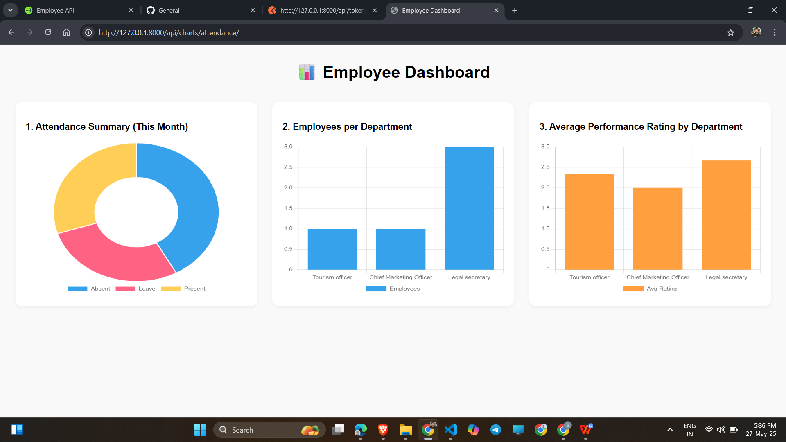

# Employee Management API - Quiz2 Project

## Note: See demo_video for a basic walkthrough of the project.

## Overview

This Django project provides an employee management system with REST APIs for employee data, attendance tracking, and performance records. It includes:

* SQLite as the default database for easy setup.
* Token-based authentication with DRF.
* Swagger UI for API documentation and testing.
* Data visualization with Chart.js integrated in Django templates.
* Pagination and filtering in APIs.
* Basic user login for accessing visualization pages.

---

<div align="center">  
  
</div>  

---

## Project Structure

```
quiz2/
├── core/                    # Django app for core functionalities
│   ├── migrations/
│   ├── templates/
│   │   └── core/
│   │       └── attendance_chart.html
│   ├── admin.py
│   ├── models.py
│   ├── serializers.py
│   ├── urls.py
│   ├── views.py
│   └── ...
├── quiz2/                   # Main Django project folder
│   ├── settings.py
│   ├── urls.py
│   └── ...
├── db.sqlite3               # SQLite database
├── manage.py
└── README.md                # This file
```

---

## Setup Instructions

### 1. Clone Repository

```bash
git clone https://github.com/ShivamKuite07/quiz2/
cd quiz2
```

### 2. Create & Activate Virtual Environment (optional but recommended)

```bash
python -m venv venv
# Windows
venv\Scripts\activate
# macOS/Linux
source venv/bin/activate
```

### 3. Install Dependencies

```bash
pip install -r requirements.txt
```

*Make sure `requirements.txt` includes at least:*

* Django
* djangorestframework
* drf-yasg
* Faker (for synthetic data)
* psycopg2 (only if switching to PostgreSQL later)

---

### 4. Run Migrations

```bash
python manage.py migrate
```

---

### 5. Create a Superuser (for admin access)

```bash
python manage.py createsuperuser
```

---

### 6. Generate Synthetic Data

You can run the custom management command to generate fake employees and attendance data:

```bash
python manage.py generate_fake_data
```

---

### 7. Run Development Server

```bash
python manage.py runserver
```

---

## API Endpoints

Here’s a complete list of your API endpoints in the format you requested, based on everything you've built so far:

---

## ✅ API Endpoints

| Endpoint                                     | Method | Description                                            | Authentication                |
| -------------------------------------------- | ------ | ------------------------------------------------------ | ----------------------------- |
| `/api/token/`                                | POST   | Obtain auth token (provide username/password in JSON)  | No                            |
| `/api/employees/`                            | GET    | List all employees (supports pagination)               | Token required                |
| `/api/employees/`                            | POST   | Create a new employee                                  | Token required                |
| `/api/employees/{id}/`                       | GET    | Retrieve employee details                              | Token required                |
| `/api/employees/{id}/`                       | PUT    | Update an employee                                     | Token required                |
| `/api/employees/{id}/`                       | DELETE | Delete an employee                                     | Token required                |
| `/api/attendance/`                           | GET    | List all attendance records                            | Token required                |
| `/api/attendance/`                           | POST   | Create new attendance entry                            | Token required                |
| `/api/attendance/{id}/`                      | GET    | Retrieve attendance entry                              | Token required                |
| `/api/attendance/{id}/`                      | PUT    | Update attendance entry                                | Token required                |
| `/api/attendance/{id}/`                      | DELETE | Delete attendance entry                                | Token required                |
| `/api/performance/`                          | GET    | List performance records                               | Token required                |
| `/api/performance/`                          | POST   | Create performance entry                               | Token required                |
| `/api/performance/{id}/`                     | GET    | Retrieve performance record                            | Token required                |
| `/api/performance/{id}/`                     | PUT    | Update performance record                              | Token required                |
| `/api/performance/{id}/`                     | DELETE | Delete performance record                              | Token required                |
| `/api/departments/`                          | GET    | List all departments                                   | Token required                |
| `/api/departments/`                          | POST   | Create a new department                                | Token required                |
| `/api/departments/{id}/`                     | GET    | Retrieve department details                            | Token required                |
| `/api/departments/{id}/`                     | PUT    | Update department                                      | Token required                |
| `/api/departments/{id}/`                     | DELETE | Delete department                                      | Token required                |
| `/api/attendance-stats/`                     | GET    | Get attendance count by employee                       | Token required                |
| `/api/charts/attendance-summary/`            | GET    | Get attendance summary data for Chart.js               | Token required                |
| `/api/charts/employees-per-department/`      | GET    | Get number of employees per department (Chart.js data) | Token required                |
| `/api/charts/avg-performance-by-department/` | GET    | Get average performance rating per department          | Token required                |
| `/api/charts/monthly-joinings/`              | GET    | Get monthly employee joining data                      | Token required                |
| `/api/charts/attendance/`                    | GET    | Render attendance dashboard web page                   | Django login session required |

---


### Authentication

* Use `/api/token/` to get an authentication token by sending JSON body:

```json
{
  "username": "shivam",
  "password": "123"
}
```

* Include token in API requests via header:

```
Authorization: Token your_token_here
```

---

## Swagger UI

Access the interactive API docs at:

```
http://127.0.0.1:8000/swagger/
```

* Use "Authorize" button in Swagger to enter:

```
Token your_token_here
```

to authenticate requests.

---

## Data Visualization

* The attendance chart page is served at:

```
http://127.0.0.1:8000/api/attendance-chart/
```

* Requires user to be logged in via Django login (session-based).
* Uses Chart.js to fetch `/api/attendance-stats/` data with token authentication.


---

## How to test APIs quickly (using Postman)

1. Request token:

```
POST http://127.0.0.1:8000/api/token/
Content-Type: application/json

{
  "username": "shivam",
  "password": "123"
}
```

2. Use the token from response in the header of other API calls:

```
Authorization: Token <token>
```

3. Test other endpoints with token.

---

## Notes

* Currently using SQLite for simplicity. To switch to PostgreSQL, update `DATABASES` in settings.
* Pagination is enabled on list APIs; provide `?page=1` query parameter.
* API throttling/rate limiting not yet implemented.
* Further improvements can include login page integration, more models, and PostgreSQL migration.

---

